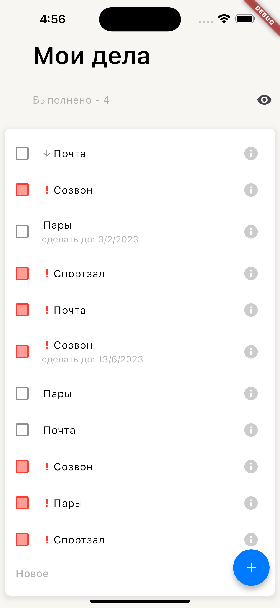

# ToDo List

MyApp - это Flutter-приложение для управления задачами, которое позволяет создавать, просматривать и удалять задачи. Оно поддерживает несколько языков, включая русский, и включает в себя удобный календарь для выбора даты.

## Основные функции

- Создание новых задач
- Просмотр списка задач
- Удаление задач
- Переключение отображения выполненных задач
- Выбор даты с помощью встроенного календаря

- Интернационализация
- Создание базы данных (и ее локальное хранение)
- Обращение к серверу

- Обработка ошибок
- Обработка потери интернета (offline-first)
- Навигация

## Скриншоты работы




Добавление новой задачи


## Установка и запуск

Для установки и запуска проекта выполните следующие шаги:

### Установка

1. Убедитесь, что у вас установлены [Flutter](https://flutter.dev/docs/get-started/install) и [Dart](https://dart.dev/get-dart).

2. Клонируйте репозиторий:

   ```sh
   git clone https://github.com/usermaryz/ToDo_smd.git

### Apk 
https://github.com/usermaryz/ToDo_smd/releases/tag/v.3